# New way to maintain settings
Time to time constants appears in your code.  Some time constants are less constant.  They have different types for example date of feature start, rfc_dest to other system, and number of parallel tasks. 

To maintain settings you have to create a table of 1 row or class for constant. Both this way has different costs to create settings, add settings, and change settings. Less is better.

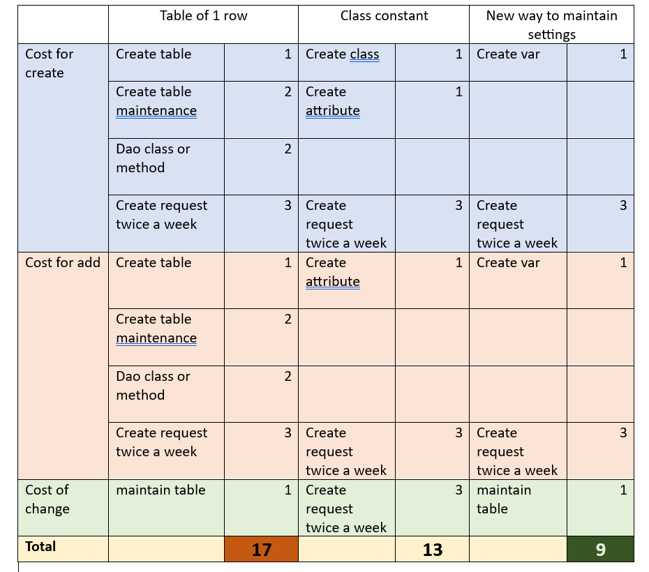

And you have tens of table of 1 row that replicate each other.

I have solution that have best part of both way to maintain settings. Easy to create, easy add, easy maintain. As bonus you can have documentation for settings like flag_25 type xfeld.

We can hold 
+ single value
+ single structure
+ table of value
+ table of struct


to hold this different variables in one table I serialized them in json and save in table of text255

to read settings:
+ select data
+ join string
+ deserealizate

# After installation navigate to screen #2 

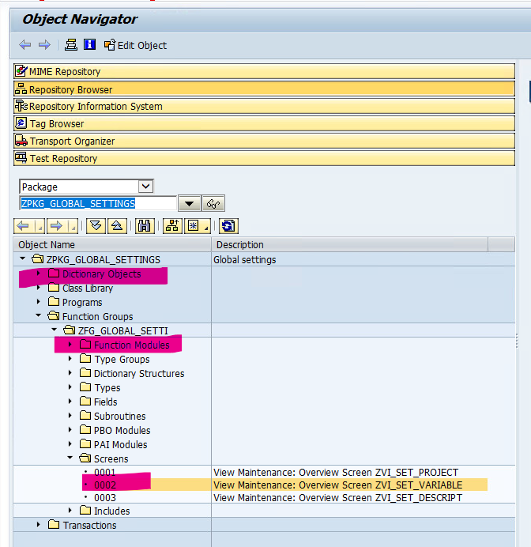

We need to adjust something 

Make layout bigger

from

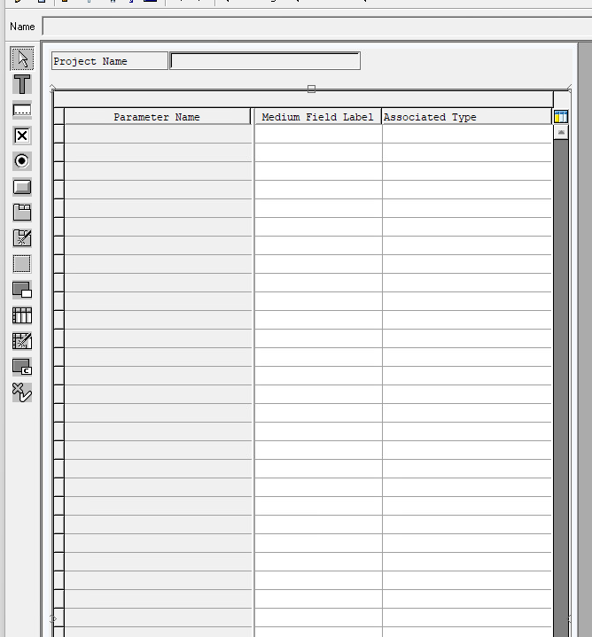 

to 

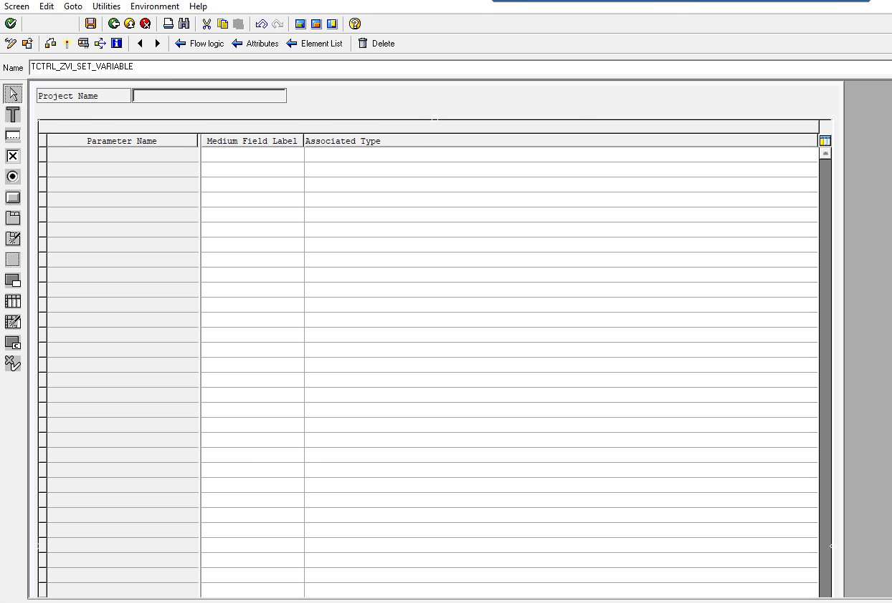

Change field size: 
Double click 

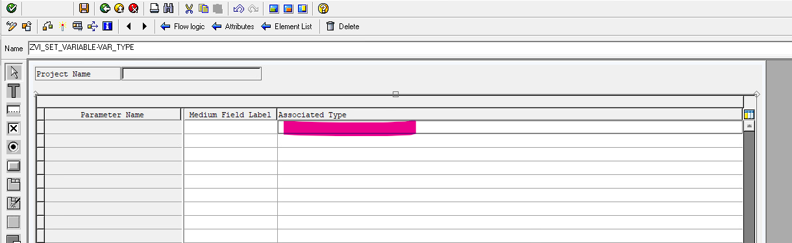

Visible length 50

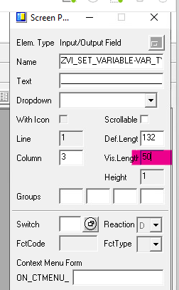

Double click

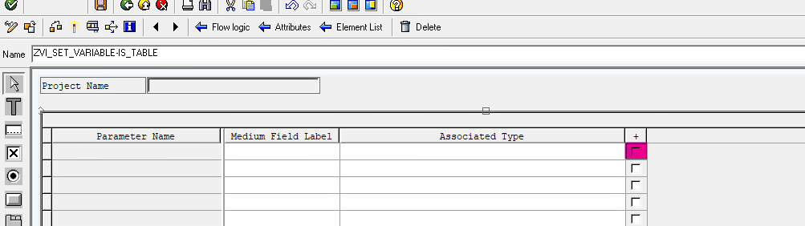

Visible length 15
 
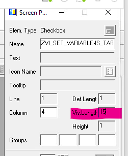

Double click

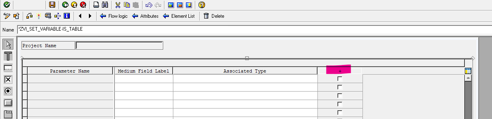

Text “Is Table?”

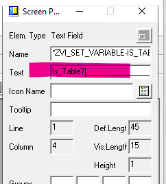

Activate!

to describe you settings go to **ZTR_GS_CONFIG** (Global Settings Configuration).

First level – project name

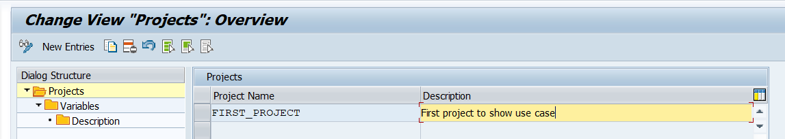

Second level variables of this project
1. Name of variable / structure / table
2. Short description
3. Abap type. For data elemet there is obligatory that this element were used in table or structure
4. Sign that it is table. You can’t use table type

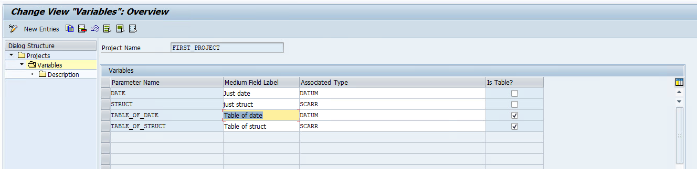

Third level is long decscription what this settings for, how they change program flow, what possible value can hold

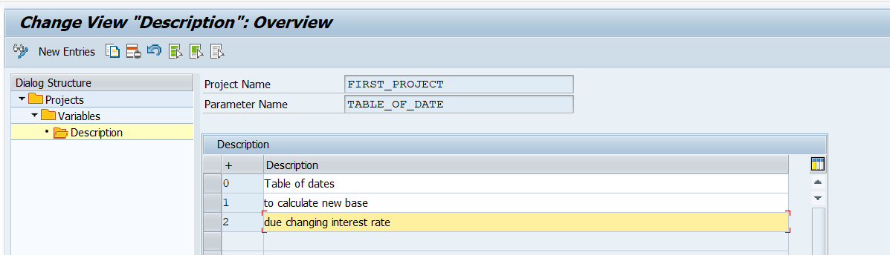

Changes save in transport request.

To edit value of settings go to **ZTR_GS_EDITOR** in each system( development, quality, production )

Enter project name or search.

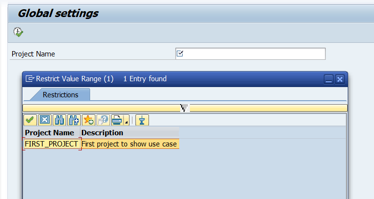

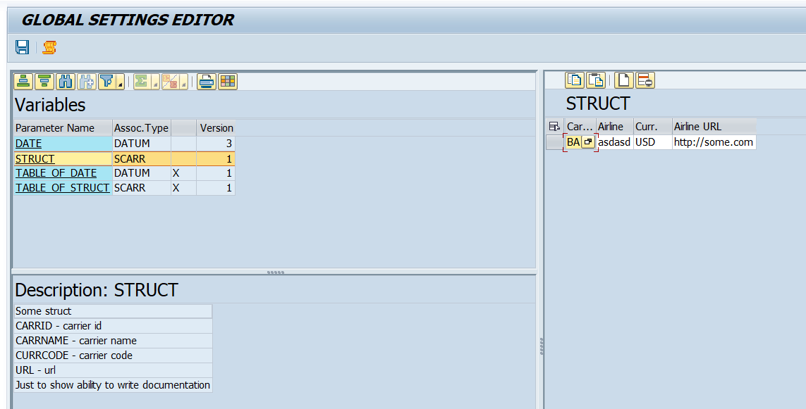

In variable block list all settings of this project. You can view or change by click on var name.

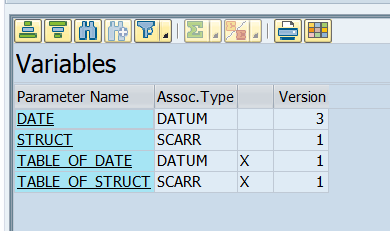

Long description in Description block.

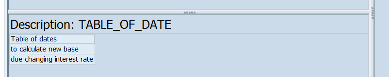

 to view history .

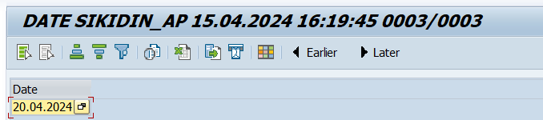

use  for navigation.

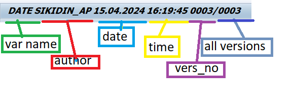

You can easy work with this settings in program.

```
REPORT Z_TEST_NEW_SETTINGS.

DATA
      : lr_gs TYPE REF TO zcl_gs " settings object

*        variable to hold settings data
      , lv_data  TYPE datum
      , lv_struct TYPE SCARR
      , lt_table_of_date  TYPE TABLE OF datum
      , lt_table_of_struct TYPE TABLE OF SCARR
      .

START-OF-SELECTION.
*create object
  lr_gs  = NEW zcl_gs( 'FIRST_PROJECT' ).

*read settings
  lr_gs->get_object( EXPORTING iv_var_name =  'DATE'
                     IMPORTING ev_data     =   lv_data ).

  lr_gs->get_object( EXPORTING iv_var_name =  'STRUCT'
                     IMPORTING ev_data     =   lv_struct ).

  lr_gs->get_object( EXPORTING iv_var_name =  'TABLE_OF_DATE'
                     IMPORTING ev_data     =   lt_table_of_date ).

  lr_gs->get_object( EXPORTING iv_var_name =  'TABLE_OF_STRUCT'
                     IMPORTING ev_data     =   lt_table_of_struct ).
*display
  cl_demo_output=>write( lv_data ).
  cl_demo_output=>write( lv_struct ).
  cl_demo_output=>write( lt_table_of_date ).
  cl_demo_output=>write( lt_table_of_struct ).

  cl_demo_output=>display( ).
```

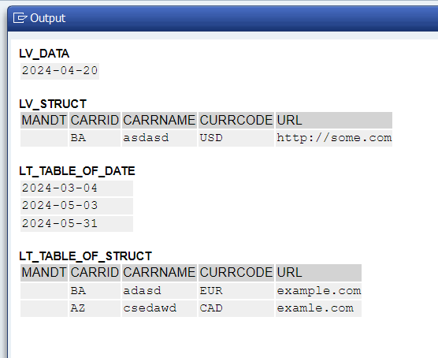

You cannot use structure or table with include with suffixes like this

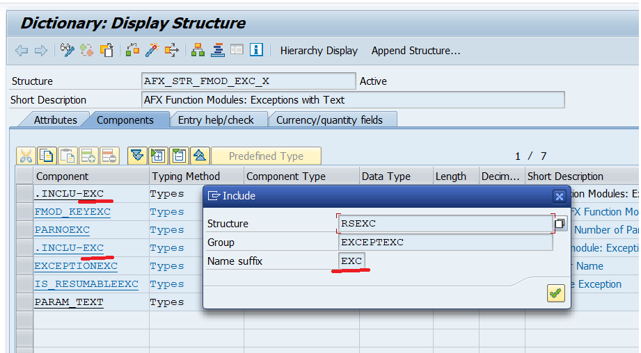


